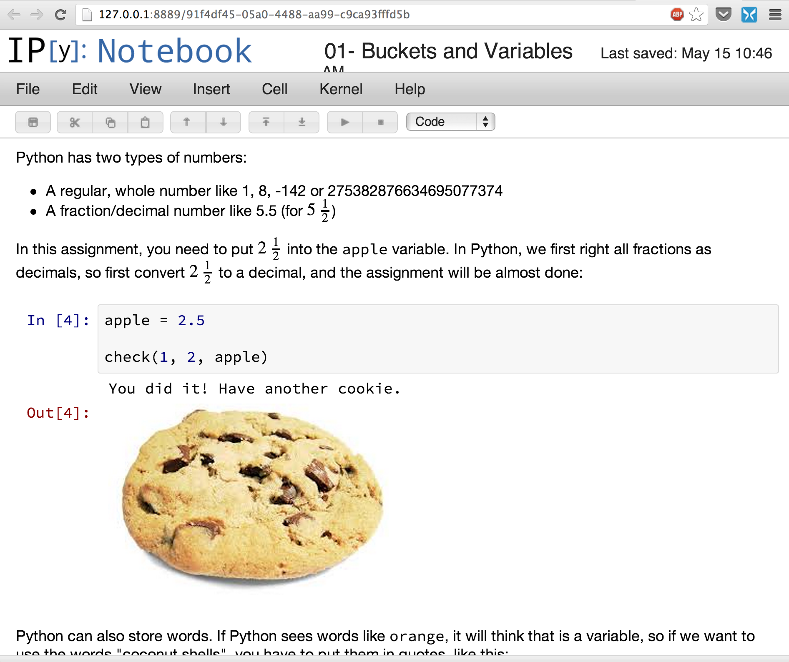

Cookies for Python
==================

If you are a Geek Parent wanting to teach your kids to program in
[Python][1], then have we got a project for you. **Cookies for
Python** is a project you can use to start the ball rolling (as well
as add to it).

Once upon a time, [Rob][rob] and [Howard][howard] were talking about
teaching their kids to follow in their footsteps and learn to program.
After [Scratch][1], a scripting language should be next on the list
for kids to learn, but most ways of teaching languages like Python are
geared towards young adults.

Specifically, we thought the following were important:

  * Instructive but still fun to read
  * Interactive
  * Gamified (do something right, get a badge... or a cookie)

This project is our attempt. It is based on the wonderful
[notebook extension][3] to [iPython][4]. You can fork, extend and even
contribute this project to share with others.

What's it Like?
--------------

The easiest way to explain what it looks like is to show a screenshot
from the browser (or download the [first lesson as a PDF](misc/01-output.pdf)):

Installation
------------

Installation is pretty simple. First, get a complete copy of
Python. If the kids are on your iMac upstairs and your a geek, chances
are good you've already installed [Homebrew][5]:

    brew install python

If you've got a difficult environment, see [these instructions][6].

Now that you have either [Pip][7] or [easy_install][8], use one of
them to grab `ipython`:

    pip install pyzmq
    pip install tornado
    pip install --upgrade ipython
    pip install numpy

Or

    easy_install ipython[zmq,notebook]

Finally, clone this project, and you're ready.

Starting
-----

The `start-me-up` script can be used to set up the iPython notebook
server and bring up a browser. If it is run a second time, it attempts
to re-connect to the same server (this seemed to be fairly important
as my kids could start it, but didn't stop it, and I had 50
interpreters running once).

If you create a symbolic link from the Desktop to this script, set the
`COOKIE_PYTHON_HOME` to the directory where the project has been
checked out, and put this in your start up script,
e.g. `.profile`. For example:

    export COOKIE_PYTHON_HOME=$HOME/Documents/cookie-python

Using
-----

Once things are started, it should be clear how to use it. Click on a
lesson, answer the questions and solve the problems, and get a cookie
reward.

Contributing
------------

This project is intended as a collaborative project between many Geek
Parents, so feel free to fork and submit patches. If you don't have a
lot of time, but would like to contribute, we specifically need help
in the following:

  * Editing of our lessons... we're programmers not writers, and it shows.
  * Freely licensed clipart images to use as rewards.
  * Python unit tests for our validation code, `check()`

  [1]: http://www.python.org
  [2]: http://scratch.mit.edu/
  [3]: http://ipython.org/notebook.html‎
  [4]: http://ipython.org
  [5]: http://www.homebrew.org
  [6]: http://ipython.org/ipython-doc/stable/install/install.html
  [7]: http://www.pip-installer.org
  [8]: http://pythonhosted.org/distribute/easy_install.html

  [howard]: https://github.com/howardabrams
  [rob]: https://github.com/robbednark
